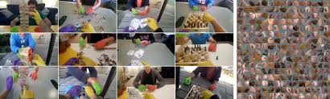
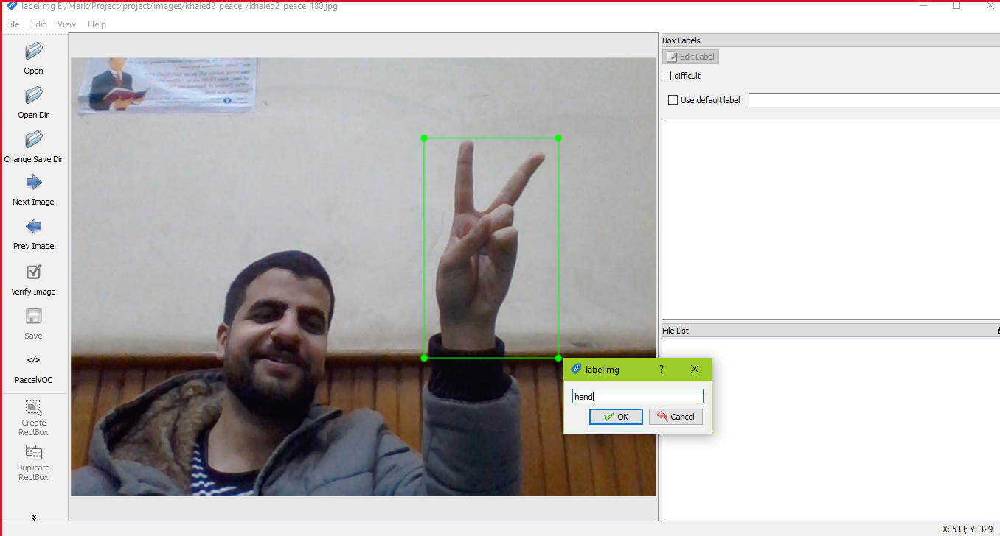
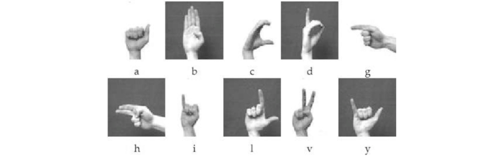
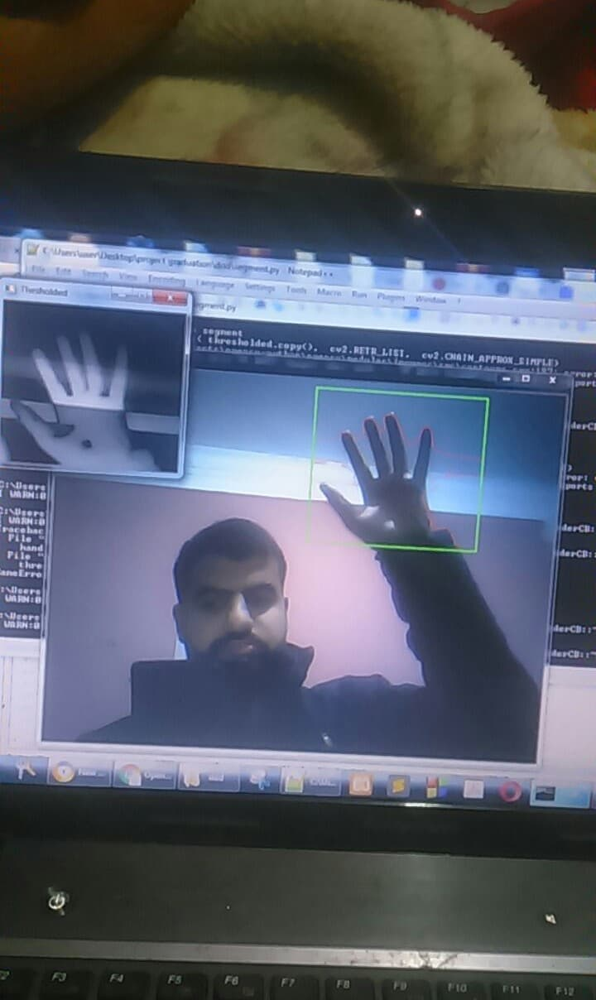
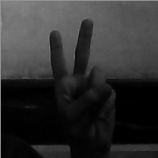
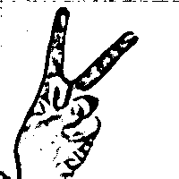
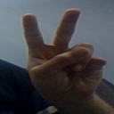
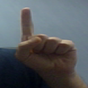
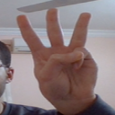
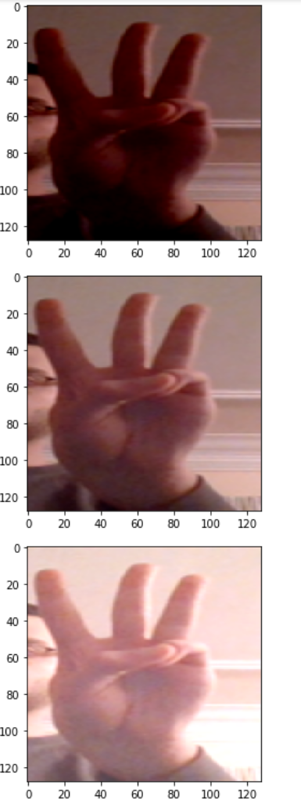

# Data perpartion:
Data perpartion is very important phase in any data science or machine learning project,if perpared data covers large scale of distrubution ,the application accuracy will be good .
 
Firstly we used data from internet that wasn't good enough ,so we created our custom data using scripts written in python.
 
### A) For shallow detector data we passed by two stages while creating data:
1-Egohands dataset:
it's dataset found online that contains labeled data for hands.

Problem:The hand was detected in palm positions only ,so we need to find another solution

2-Creating our custom data:
 
-In this stage we have made script that opens the camera ,while running the script press n then give a folder name ,this name is used by script to create a folder and save images inside it,then press s to start taking images and saving them inside the folder.
 
-Then we took these images and start labeling it using  label_Img application by drawing a green box around the hand.
 
-we can make using that script more samples which leads to better accuracy

#### -------------------------------------------------------------------------------------------------------------------------------------------------------------

###  B) For the deep classifier data:

1)In this stage we take dataset from internet:
Static Hand Posture Databases,Jochen Triesch Static Hand Posture Database.
-It was Low Quality Dataset which leads to bad accuracy.

2)In this stage we have made script that opens the camera ,while running the script press n then give a folder name ,this name is used by script to create a folder and save images inside it,then put your hand in the green box that appears to you and press s to start taking images while  and saving them inside the folder.(it takes only the green box and save it).
 
-we save images in grey scale and binary format,it leads to bad accuracy as hand loses alot of its features(skin color matches the background color) .

3)It's like second stage but instead of saving images in binary format,we save it in RGB, so we solved the problem of matching between skin color and background (reducing hand features) as image is taken in RGB (more features are considered).
 
-we still have some problems like limitations in illumination ,small Samples and fixed Background.

-we are not able to take large samples,as the script is saving what is inside the box also if your hands is not inside,so we need to filter all samples taken manually,it was a time consuming job.

4)In this stage the sallow detector was working good,so we integrate it with script to make script capture frames only if there is hand in front of your camera and save the part of images that contains hands , as detector detect coordinates of hand ,so we don't need now for green box and manual filteration.
 
-we solved the problem of small samples and fixed background, we are able now to take more samples with different backgrounds.

-we still have some limitations:fixed illumination setups and problems with classifying left hands..

5) To solve problem of illumination and left hands,we made augementation for data,we make a script that changes brightness of already created images and another script to flip images to be look like as left hands.
 
-We have solved all the problems that appeared in previous stages.
 

